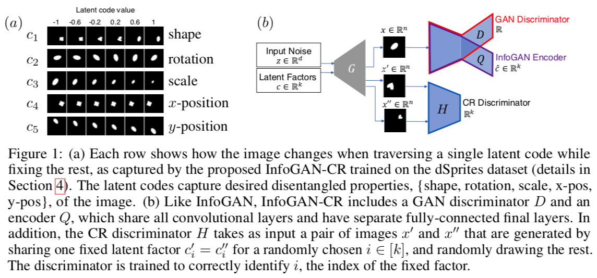
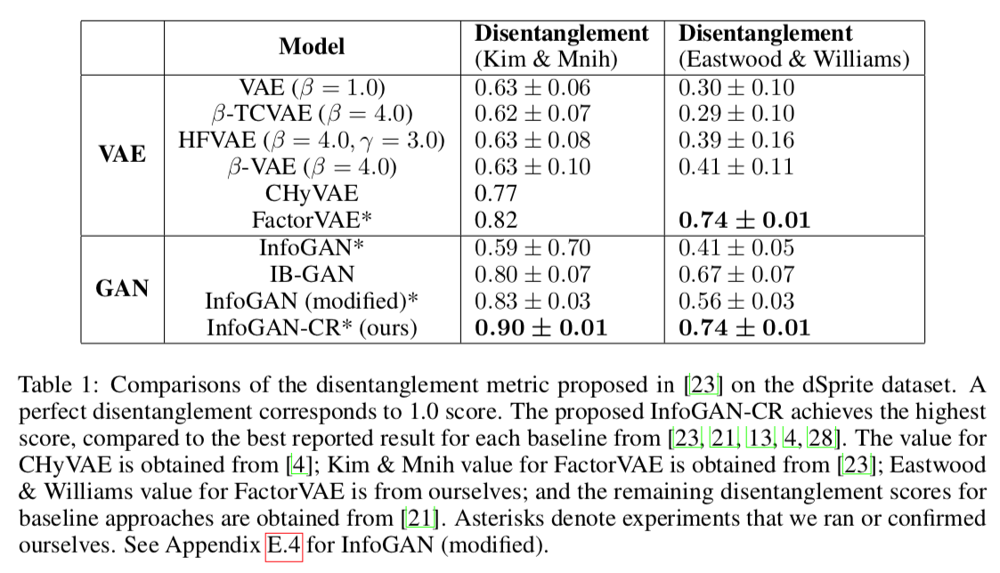

# InfoGAN-CR: Disentangling Generative Adversarial Networks with Contrastive Regularizers

**[[paper (arXiv)](https://arxiv.org/abs/1906.06034)]**
**[[code](https://github.com/fjxmlzn/InfoGAN-CR)]**


**Authors:** [Zinan Lin](http://www.andrew.cmu.edu/user/zinanl/), [Kiran Koshy Thekumparampil](https://scholar.google.com/citations?user=0gJQCIgAAAAJ&hl=en), [Giulia Fanti](https://www.andrew.cmu.edu/user/gfanti/), [Sewoong Oh](https://homes.cs.washington.edu/~sewoong/)

**Abstract:** Training disentangled representations with generative adversarial networks (GANs) remains challenging, with leading implementations failing to achieve comparable performance to Variational Autoencoder (VAE)-based methods. After beta-VAE and FactorVAE discovered that regularizing the total correlation of the latent vectors promotes disentanglement, numerous VAE-based methods emerged. Such a discovery has yet to be made for GANs, and reported disentanglement scores of GAN-based methods are significantly inferior to VAE-based methods on benchmark datasets. To this end, we propose a novel regularizer that achieves higher disentanglement scores than state-of-the-art VAE- and GAN-based approaches. The proposed contrastive regularizer is inspired by a natural notion of disentanglement: latent traversal. Latent traversal refers to generating images by varying one latent code while fixing the rest. We turn this intuition into a regularizer by adding a discriminator that detects how the latent codes are coupled together, in paired examples. Numerical experiments show that this approach improves upon competing state-of-the-art approaches on benchmark datasets. 

---
This repo contains the codes for generating datasets and reproducing results in paper. The codes were tested under Python 2.7.5, TensorFlow 1.4.0.

## Metrics
This repo contains our implementation of [FactorVAE metric](https://arxiv.org/abs/1802.05983), [BetaVAE metric](https://openreview.net/forum?id=Sy2fzU9gl), [SAP](https://arxiv.org/abs/1711.00848), [MIG](https://arxiv.org/abs/1802.04942), [Explicitness](https://arxiv.org/abs/1802.05312), [Modularity](https://arxiv.org/abs/1802.05312), [DCI](https://openreview.net/forum?id=By-7dz-AZ&noteId=By-7dz-AZ), and [dHSIC](http://papers.nips.cc/paper/7850-information-constraints-on-auto-encoding-variational-bayes). It also includes Inception Score, mode KL, and classifier confidence for dSprites discussed in our paper. 
The metrics are implemented in `metric.py`. You can choose to calculate any set of metrics during training for plotting the training curve, or calculate them only on the final trained model to save time. See below for the examples.

## Preparing datasets

### 3D Teapot
3D Teapot dataset was originally proposed by [Eastwood et al.](https://openreview.net/pdf?id=By-7dz-AZ). However, the code for generating this dataset was not published, thus we cannot calculate [Kim & Mnih disentanglement metric](https://arxiv.org/pdf/1802.05983) which requires additional data. We try to reproduce the dataset, and make several extensions to it, based on [this renderer](https://github.com/polmorenoc/opendr) by Pol Moreno. We provide all our codes for generating the datasets. 

**The datasets can be downloaded [here](https://drive.google.com/drive/folders/1tyTgGZ4Yb2hXCLoXxvUZPJ-y3pFd4I_E?usp=sharing).**

The steps of running 3D Teapot dataset generator by your own are as follows:

* `git clone https://github.com/polmorenoc/opendr`. (Or use my forked version: https://github.com/fjxmlzn/opendr)
* Copy all files in `3D_teapot` folder in this repo to `opendr` folder.
* Follow the instructions on [https://github.com/polmorenoc/opendr](https://github.com/polmorenoc/opendr) to install the required library, and download `teapotModel.pkl` to `opendr/data` folder.
* `cd opendr`. Then you can run:
	* `python generate_teapots_all_color_incomplete_rotation_up_light.py`: this code tries to reproduce [the original 3D Teapot dataset](https://github.com/cianeastwood/qedr), which contains teapots with different colors, incomplete rotations, and the light source is from the top. Note that since we do not know the parameters (e.g., teapot size, shape translation) that the original dataset uses, the data generated by this code may be different from the original one. 
	* `python generate_teapots_fixed_color_complete_rotation_up_light.py`: this code generates teapots with a fixed color, all possible rotations (uniformly), and the light source is from the top.
	* `python generate_teapots_fixed_color_complete_rotation_uniform_light.py`: this code generates teapots with a fixed color, all possible rotations (uniformly), and the direction of the light source is also uniformly random among all possibilities.
	> Those three files are modified from [generate_teapots.py](https://github.com/polmorenoc/opendr/blob/master/generate_teapots.py).
* After running the above codes, you will get the following files in a corresponding folder

```
train_data/
├── data.npz
metric_data/
├── data.npz
```
`train_data/data.npz` contains samples for training, and `metric_data/data.npz` contains samples for evaluating [Kim & Mnih disentanglement metric](https://arxiv.org/pdf/1802.05983). Please copy them (keep directory structure) to the `data` folder in code (see below).


### CelebA
Download `img_align_celeba.zip` from [https://www.kaggle.com/jessicali9530/celeba-dataset](https://www.kaggle.com/jessicali9530/celeba-dataset) (or other source), and put it in `CelebA` folder. Then run `python process_celeba.py`. This code will crop and resize the images into 32x32x3 format. Please copy the generated `data.npz` to the `data` folder in code (see below).


### dSprites
Download `dsprites_ndarray_co1sh3sc6or40x32y32_64x64.npz` from [https://github.com/deepmind/dsprites-dataset](https://github.com/deepmind/dsprites-dataset) and put it in the `data` folder in code (see below).

## Train models
The codes are based on [GPUTaskScheduler](https://github.com/fjxmlzn/GPUTaskScheduler) library, which helps you automatically schedule jobs among GPU nodes. Please install it first. You may need to change GPU configurations according to the devices you have. The configurations are set in `config.py` in each directory. Please refer to [GPUTaskScheduler's GitHub page](https://github.com/fjxmlzn/GPUTaskScheduler) for details of how to make proper configurations.

> You can also run these codes without GPUTaskScheduler. Just run `python infogan_cr.py` or `python factorVAE.py` in `gan` subfolders.

### InfoGAN-CR, dSprites dataset
```
cd InfoGAN-CR_dSprites
```
Copy dSprites data files to `data/dSprites`.

```
cd gan
python train_DSpritesInceptionScore.py # train the network for evaluating inception score on dSrpites dataset
cd ..
python main.py
```
Compute all the metrics for the final trained model:

```
python main_final_metrics.py
```

### FactorVAE, dSprites dataset
```
cd FactorVAE_dSprites
```
Copy dSprites data files to `data/dSprites`.

```
cd gan
python train_DSpritesInceptionScore.py # train the network for evaluating inception score on dSrpites dataset
cd ..
python main.py
```
Compute all the metrics for the final trained model:

```
python main_final_metrics.py
```

### InfoGAN-CR, 3D teapot
```
cd InfoGAN-CR_3D_teapot
```
Copy 3D Teapot data files to `data/3Dpots`.

```
python main.py
```
Compute all the metrics for the final trained model:

```
python main_final_metrics.py
```

### FactorVAE, 3D teapot
```
cd FactorVAE_3D_teapot
```
Copy 3D Teapot data files to `data/3Dpots`.

```
python main.py
```
Compute all the metrics for the final trained model:

```
python main_final_metrics.py
```

### InfoGAN-CR, CelebA
```
cd InfoGAN-CR_CelebA
```
Copy CelebA data files to `data/celeba`.

```
python main.py
```

### Notes on metric calculation
You can easily change the metrics that you want to calculate throughout training by modifying `metric_callbacks` list in `gan_task.py` or `factorvae_task.py`. You can also easily change the metrics that you want to calculate for the final trained model by modifying the metrics in `gan_task_final_metrics.py` or `factorvae_task_final_metrics.py`.

## Pre-trained models
### InfoGAN-CR, CelebA
```
cd InfoGAN-CR_CelebA
```
Copy CelebA data files to `data/celeba`.

Create a sub-folder `results`, download the [pretrained model](https://drive.google.com/file/d/1-g6C-uug36rg0gZi1ESI6G2YuOC4H7l3/view?usp=sharing), and decompress it into `results` sub-folder.

```
python main_generate_latent_trans.py
```
This code will generate latent traversal images in `results/cr_coe_increase-1.0,cr_coe_increase_batch-80000,cr_coe_increase_times-1,cr_coe_start-0.0,gap_decrease-0.0,gap_decrease_batch-1,gap_decrease_times-0,gap_start-0.0,info_coe_de-2.0,info_coe_infod-2.0,run-0,/latent_trans/`.

## Results




The detailed explanation of the idea, architectures, hyperparameters, metrics, and experimental settings are given in the paper.
